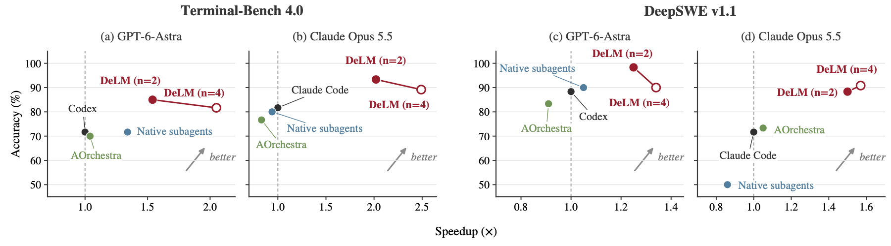
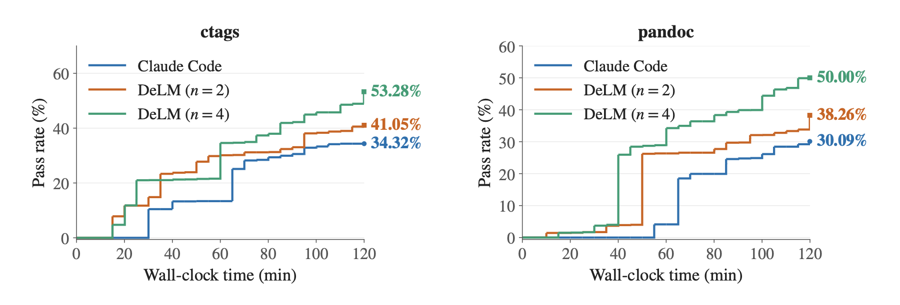
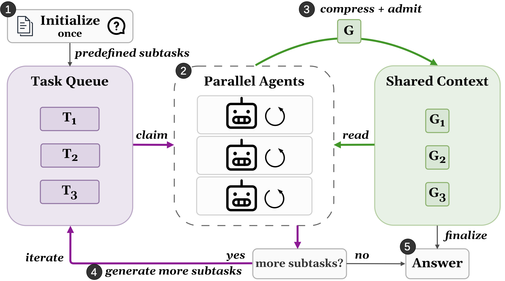

<h1 align="center">
  <a href="https://yuzhenmao.github.io/DeLM/">
    
  </a>
</h1>
<h3 align="center">Decentralized Multi-Agent Systems with Shared Context</h3>

<p align="center">
  Parallel agents coordinate asynchronously through a shared context and task queue to solve tasks faster and more accurately.
</p>

<p align="center">
  <a href="https://arxiv.org/abs/2606.10662"><b>Paper</b></a> ·
  <a href="https://yuzhenmao.github.io/DeLM/"><b>Project Website</b></a> ·
  <a href="https://huggingface.co/datasets/yuzhenm/delm-720-trajectories"><b>Trajectories</b></a> ·
  <a href="#quickstart"><b>Quickstart</b></a> ·
  <a href="#results"><b>Results</b></a> ·
  <a href="#cli-reference"><b>CLI Reference</b></a>
</p>

**Open trajectories:** We also release all **720 DeLM agent trajectories** from our
Terminal-Bench 4.0 and DeepSWE v1.1 evaluations on
[Hugging Face](https://huggingface.co/datasets/yuzhenm/delm-720-trajectories).

**DeLM runs agents in parallel and lets them coordinate through a shared
context and task queue.** Agents claim work, publish findings, and reuse each
other's files asynchronously. Each agent keeps its own workspace and produces a
complete solution.

- **Decentralized coordination:** peers share progress through the shared context, without a main agent relaying their work.
- **Higher accuracy with lower latency:** on the paper's 10-task Terminal-Bench 4.0 subset, DeLM with two agents averages **+12.5 percentage points** and **1.78× speedup** over the base harnesses across two models.
- **Two harnesses, one engine:** this branch runs **n=2 or n=4** with **Codex or Claude Code**, using independent Docker images and a shared evaluation pipeline.

---

## Installation

Use **Python 3.13+**, Git, **Linux Docker Engine with BuildKit**, and Docker Compose
for tasks that include services. Agent CLIs and the
[Humanize](https://github.com/humanfia/humanize) driver are installed inside the
images by the Dockerfiles. DeLM uses Humanize to run Codex and Claude Code sessions
and consume their streaming events.

```bash
git clone --branch main https://github.com/yuzhenmao/DeLM.git
cd DeLM
```

Use an idle host with capacity for all workers: each worker receives the official
task's full CPU, memory, and storage allocation. The runtime additionally reserves
4 GiB of host RAM. Service resources are reserved per worker's service group.

## Quickstart

### 1. Fetch a task and build an image

```bash
python3.13 fetch_task.py retro-console-soc \
  --revision 452bf305c6daa62fc59061d22133a7cbc7c1572e

# Choose the harness you will run:
python3.13 build_task.py tasks/terminal-bench-4.0/retro-console-soc --harness codex
# Or:
python3.13 build_task.py tasks/terminal-bench-4.0/retro-console-soc --harness claude-code
```

Each build runs in the background and prints its output folder. Wait for
`result.json`; confirm `returncode` is `0` before launching. The `stages` field
records the base, runtime, verifier, and service build outcomes; a failure stops
the build and returns a nonzero code.

| Harness | Dockerfile | Task image |
| --- | --- | --- |
| Codex | [Dockerfile.codex](Dockerfile.codex) | `delm-workspace-<task>:local` |
| Claude Code | [Dockerfile.claude](Dockerfile.claude) | `delm-<task>:claude-2.1.280` |

Both builds start from the unchanged official task image,
`delm-task-<task>:base`. They are independent: building Claude does not require
building Codex. Each image supports both worker counts.

Runtime versions and model defaults are defined in [runtime/config.py](runtime/config.py).
The build script supplies those versions to both Dockerfiles. Locally built images
are checked against the task source before a run; rebuild older images with
`build_task.py` to add this source metadata. Rebuilding uses Docker's layer cache.

### 2. Choose authentication and launch

Use one of the following commands after building its matching image. API keys
must be raw, single-line files with mode `600` or stricter, stored outside the
checkout or inside ignored `.local/`. Replace the example credential paths with
your own. Launch from a clean, committed checkout.

**Codex with an API key**

```bash
python3.13 -B delm.py retro-console-soc --n 2 --harness codex \
  --auth-mode api-key --api-key-file /secure/openai.key \
  --series astra-api-n2 --repeat 1 --model gpt-6-astra --effort xhigh
```

**Codex with a coding plan**

Use an existing Codex ChatGPT login file, also private with mode `600` or stricter:

```bash
python3.13 -B delm.py retro-console-soc --n 2 --harness codex \
  --auth-mode coding-plan --auth-file ~/.codex/auth.json \
  --series astra-plan-n2 --repeat 1 --model gpt-6-astra --effort xhigh
```

**Claude Code with an API key**

```bash
python3.13 -B delm.py retro-console-soc --n 2 --harness claude-code \
  --auth-mode api-key --api-key-file /secure/anthropic.key \
  --series opus-api-n2 --repeat 1 --model claude-opus-5-5 --effort xhigh
```

**Claude Code with a coding plan**

Run `claude setup-token` on a machine where you can complete the subscription
login, then save only the returned OAuth token in a private file such as
`/secure/claude.token` (mode `600`). This is a raw token file, not a Claude login
JSON file or an API key. See the official
[subscription token instructions](https://code.claude.com/docs/en/authentication#generate-a-long-lived-token).

```bash
python3.13 -B delm.py retro-console-soc --n 2 --harness claude-code \
  --auth-mode coding-plan --auth-file /secure/claude.token \
  --series opus-plan-n2 --repeat 1 --model claude-opus-5-5 --effort xhigh
```

The token file is mounted read-only. The worker loads it into its own environment,
checks that Claude selected subscription OAuth, and omits the API-key helper.
Host logins and settings are not imported. An expired or invalid token fails the
run without switching to API billing; replace the token file when it expires.
Tokens are not included in command arguments or run metadata. CLI-reported cost
fields are not a subscription bill.

For four workers, change `--n 2` to `--n 4` and use a new `--series` name. Add
`--dry-run` to inspect the resolved plan without reading credentials, starting
containers, or calling a model. For tasks with services, supply positive
`--service-cpus` and `--service-memory-mb` reservations per worker.

### 3. Inspect trajectories and results

```bash
python3.13 inspect_run.py .local/runs/astra-api-n2/retro-console-soc/repeat-1
python3.13 -m reporting.report
```

The report is written to `.local/reports/results.md`. The reader supports both
worker counts, retains failed or incomplete runs, and leaves missing measurements
unknown. Use `--runs-root` and `--output` to select another collection or output
path. Reporting never modifies run records or invokes grading.

---

## Results

Accuracy averages independently graded agent submissions; it is not best-of-n
success. See the [paper's metric definitions](https://arxiv.org/html/2606.10662#S3)
and [full results](https://yuzhenmao.github.io/DeLM/#results) for costs and other
baselines.

<p align="center">
  
</p>

### Terminal-Bench 4.0

Evaluation uses **10 selected long-horizon tasks**, chosen by the latency of the
Codex baseline (see the paper's Appendix B). The table shows the single-agent
harness and DeLM configurations; the paper and website also include native-subagent
and AOrchestra baselines. Values are mean ± standard deviation over three runs,
and speedup is relative to the corresponding single-agent harness.

<details>
<summary>Show Terminal-Bench 4.0 results</summary>

| Model | Method | Accuracy (%) ↑ | Latency (min) ↓ | Speedup ↑ |
| --- | --- | ---: | ---: | ---: |
| GPT-6-Astra | Codex | 71.67 ±11.55 | 26.91 ±0.91 | 1.00× |
| GPT-6-Astra | DeLM (n=2) | **85.00 ±13.23** | 17.47 ±1.82 | 1.54× |
| GPT-6-Astra | DeLM (n=4) | 81.67 ±12.33 | **13.16 ±1.43** | **2.05×** |
| Claude Opus 5.5 | Claude Code | 81.67 ±2.89 | 130.75 ±6.27 | 1.00× |
| Claude Opus 5.5 | DeLM (n=2) | **93.33 ±3.33** | 64.77 ±5.03 | 2.02× |
| Claude Opus 5.5 | DeLM (n=4) | 89.17 ±5.20 | **52.51 ±4.43** | **2.49×** |

</details>

### DeepSWE v1.1

Evaluation uses **10 selected long-horizon tasks**, chosen by the latency of the
Codex baseline (see the paper's Appendix B). As in the Terminal-Bench table, the
rows compare each single-agent harness with DeLM at n=2 and n=4. Values are
mean ± standard deviation over three runs; latency is in minutes, and speedup is
relative to the corresponding single-agent harness.

<details>
<summary>Show DeepSWE v1.1 results</summary>

| Model | Method | Accuracy (%) ↑ | Latency (min) ↓ | Speedup ↑ |
| --- | --- | ---: | ---: | ---: |
| GPT-6-Astra | Codex | 88.33 ±2.89 | 16.57 ±0.39 | 1.00× |
| GPT-6-Astra | DeLM (n=2) | **98.33 ±2.89** | 13.29 ±0.98 | 1.25× |
| GPT-6-Astra | DeLM (n=4) | 90.00 ±10.00 | **12.37 ±0.66** | **1.34×** |
| Claude Opus 5.5 | Claude Code | 71.67 ±2.89 | 49.58 ±3.11 | 1.00× |
| Claude Opus 5.5 | DeLM (n=2) | 88.33 ±2.89 | 32.98 ±2.47 | 1.50× |
| Claude Opus 5.5 | DeLM (n=4) | **90.83 ±8.78** | **31.61 ±0.96** | **1.57×** |

</details>

### SWE-bench Verified

All methods use **Gemini 3 Flash**. For this benchmark, DeLM is built on
**AOrchestra's harness** rather than Codex or Claude Code. Values are
mean ± standard deviation over three runs. Latency is in **seconds**, and speedup
is relative to Claude Code.

<details>
<summary>Show SWE-bench Verified results</summary>

| Model | Method | Accuracy (%) ↑ | Latency (s) ↓ | Speedup ↑ |
| --- | --- | ---: | ---: | ---: |
| Gemini 3 Flash | Claude Code | 49.32 ±1.98 | 129.13 ±5.12 | 1.00× |
| Gemini 3 Flash | mini-SWE-agent | 54.73 ±2.37 | 91.78 ±3.53 | 1.41× |
| Gemini 3 Flash | AOrchestra | 55.26 ±2.03 | 89.94 ±3.07 | 1.44× |
| Gemini 3 Flash | DeLM (n=2) | 63.72 ±2.29 | 71.86 ±2.88 | 1.80× |
| Gemini 3 Flash | DeLM (n=4) | **66.08 ±1.86** | **61.01 ±2.63** | **2.12×** |

</details>

### ProgramBench

Claude Opus 5.5 with Claude Code as the harness, on **ctags and pandoc** under a
**120-minute budget**. The metric is the hidden-test pass rate, tracked as
development progresses; the table reports the pass rate at the end of the budget.

<details>
<summary>Show ProgramBench results</summary>

| Method | ctags (%) ↑ | pandoc (%) ↑ |
| --- | ---: | ---: |
| Claude Code | 34.32 | 30.09 |
| DeLM (n=2) | 41.05 | 38.26 |
| DeLM (n=4) | **53.28** | **50.00** |

</details>

<p align="center">
  
</p>

---

## How it works

<p align="center">
  
</p>

1. **Claim work.** Agents claim open tasks from a common task queue, and any agent can add new tasks. The queue shows who owns each task, so agents can choose complementary work.
2. **Publish progress.** Findings, failed approaches, and completed subtasks are added to an append-only shared context, with files attached by reference.
3. **Reuse and correct.** Peers read relevant entries and import shared files into their own workspaces while continuing their work. Defects are reported as `FAIL` entries and fixed by new entries rather than edits.
4. **Submit independently.** Each worker produces a complete solution for the official verifier.

In this implementation, the shared board and HTTP client live in [board/](board/).
File application checks local edits and file authorship before copying a selected
batch. Conflicts reject the batch so the agent can inspect and reconcile the files
locally; the engine does not automatically merge conflicting edits.

### Shared runtime for n=2 and n=4

| Setting | Codex | Claude Code |
| --- | --- | --- |
| Pinned CLI | 0.153.4 | 2.1.280 |
| Default model | `gpt-6-astra` | `claude-opus-5-5` |
| Reasoning effort | `xhigh` | `xhigh` |
| Authentication | API key or coding plan | API key or coding plan |
| Workers | 2 or 4 | 2 or 4 |

Both harnesses select authentication with `--auth-mode api-key|coding-plan`.
Coding-plan mode takes a Codex ChatGPT `auth.json` or a Claude `setup-token` file,
respectively, through `--auth-file`.

For either harness, `--model MODEL_ID` overrides the default model. Runtime and
trajectory checks verify the selected model. Reasoning effort remains `xhigh`;
there is no automatic model fallback or effort downgrade.

Both use Humanize commit
[413d02e44d0cc0514b9f5bd3fcefea156b047a49](https://github.com/humanfia/humanize/commit/413d02e44d0cc0514b9f5bd3fcefea156b047a49)
and the common
[runtime/runner.py](runtime/runner.py). Authentication, overwrite protection,
collection, and grading use the same implementation for both worker counts. The
roster and prompt depend on `n`: the n=2 and n=4 prompts in [prompts/](prompts/)
assign different initial roles (see the paper's Appendix E), so changing `n` is
not a count-only prompt ablation. The n=2 prompt uses the same `apply` description
as the n=4 prompt.

Official task instructions, resources, verifiers, and model time limits are
preserved. After workers finish, the runner captures every submission, stops the
task environments, and grades serially. The extra 600-second process cleanup guard
does not extend model time. Failed and incomplete attempts remain in the records
and are not automatically retried or overwritten.

---

## Directory Structure

```text
.
├── delm.py                  # Public launcher and argument checks
├── fetch_task.py            # Download an official task at a pinned revision
├── build_task.py            # Build the task and selected harness image
├── inspect_run.py           # Inspect one saved run
├── Dockerfile.codex         # Independent Codex runtime
├── Dockerfile.claude        # Independent Claude Code runtime
├── runtime/                 # Shared engine, provider adapters, and native workers
├── board/                   # Shared context, task queue, and file protection
├── prompts/                 # n=2 and n=4 prompts and initial roles
├── benchmark/               # Task validation, services, collection, and grading
├── reporting/               # Read-only run readers and Markdown reports
├── LICENSE                  # MIT license
├── index.html               # Project website
└── website/                 # Project website assets
```

Downloaded tasks and runtime outputs are ignored by Git. Credentials,
trajectories, benchmark datasets, and archives are not committed.

---

## CLI Reference

### Launch options

```bash
python3.13 delm.py --help
python3.13 build_task.py --help
```

| Option | Meaning |
| --- | --- |
| `task` | Fetched Terminal-Bench task name, such as `retro-console-soc` |
| `--n 2\|4` | Number of DeLM workers; default `2` |
| `--harness codex\|claude-code` | Agent harness; default `codex` |
| `--series NAME` | Required experiment series with immutable settings |
| `--repeat N` | One repeat number, starting at `1`; does not launch a loop |
| `--model MODEL` | Defaults to `gpt-6-astra` or `claude-opus-5-5` |
| `--effort xhigh` | Reasoning effort; `xhigh` is the only supported value and the default |
| `--auth-mode api-key\|coding-plan` | Explicit authentication choice; default `api-key` |
| `--api-key-file PATH` | Private raw key file for API-key mode |
| `--auth-file PATH` | Private Codex `auth.json` or raw Claude `setup-token` file for coding-plan mode |
| `--service-cpus N` | Additional CPU reservation per worker's service group |
| `--service-memory-mb N` | Additional RAM reservation per worker's service group |
| `--dry-run` | Print the resolved plan without launching |

A dry run still requires a credential path, but the file need not exist. Use
separate invocations with `--repeat 2`, `--repeat 3`, and so on for more repeats.
Changes to code, worker count, harness, authentication, model, service budgets, or
task image require a new series. Existing attempts are never overwritten.

---

## Citation

```bibtex
@misc{mao2026delm,
  title         = {Decentralized Multi-Agent Systems with Shared Context},
  author        = {Yuzhen Mao and Jerry Gu and Aadi Chauhan and
                   Qizheng Zhang and Hangoo Kang and Azalia Mirhoseini},
  year          = {2026},
  eprint        = {2606.10662},
  archivePrefix = {arXiv},
  primaryClass  = {cs.MA},
  url           = {https://arxiv.org/abs/2606.10662}
}
```
